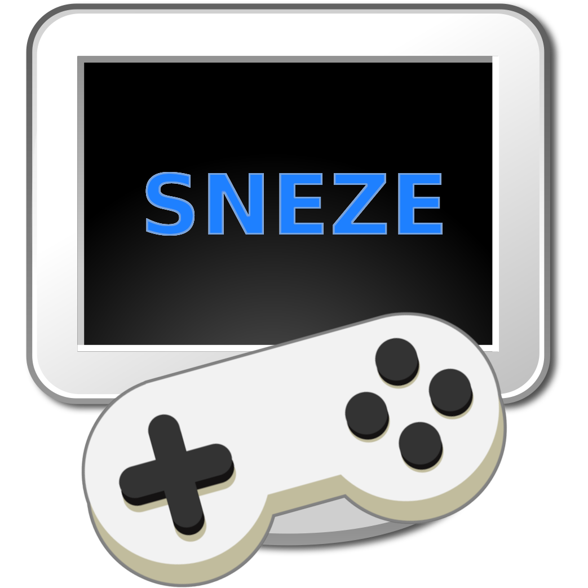

# Simple Not Easy Zestful Engine

  

SNEZE is a high-level, 2D game engine based in a entity component system that provides solutions for common game problems. The goal is to make game development fast and simple, but not easy, while also being zestful.

## Features (ready)
- Simple to use however is not easy to master.
- Entity Component System, entities, globals and events.
- Application Management, configuration, settings and logging.
- Window creation, save position and monitor.
- Switching between full screen (borderless) and windowed mode.
- Bitmap fonts rendering, including kerning, and alignment, Using [angelcode](https://www.angelcode.com/products/bmfont/) format.
- Shape rendering, including lines, rectangles, solid and border box.
- Sprite rendering, including sheets, with scaling, rotation & color tint. Using [free-tex-packer](http://free-tex-packer.com/) format.
- Layout management, including anchoring.
- Automatic scaling, no letter-box, no black bars, including resolution changes.
- Input management, currently keyboard and mouse.
- Code centric, no editor for game logic, just code.
- Already made common effects for any game, as blinking.
- High-level Engine allowing developers to focus more on game logic instead of engine logic.
- Multi-platform : Windows, Mac, Linux.
- No required to install dependencies, will be downloaded automatically.

## Features (WIP)
- Sprite animations.
- Documentation, including API reference.
- Gamepad support.
- Audio support.
- High level components, such progress bars, floating text, etc.
- Solutions for Common Game Problems, such as handling state, transitions.
- Patterns for Basic Game Scenes such as maps, menus, tiled, scrolling, or UI.
- More common effects as rotate, fade in/out, etc.
- Common game systems such sound or controller support.

## Background
After several years using different game engines I always end create a lot of common code with features that are usually too high-level for those engines to support but are required for most of the games that I do. 

This could be as simple flashing a sprite in red color when a player hit an enemy, transition between game states such fade-in-out or to allow the game window to be resized and keeping the game scaling correctly, even if the aspect ratio change.

This engine is trying to step up that effort to allow to focus on the game logic and solve common problems, however keep it configurable some this could be customized by the game.

However, I understand that is very opinionated and not everyone will like it, however you can use the features that you like and ignore the rest.

## Why Not...

You may be wondering why I do not support some of the features that are usually found in game engines, such as:

- Mobile platforms.
- Webassembly.
- 3D rendering.
- Physics.

To be honest, I do not have the time to support all of those features. However, I am open to contributions, so if you want to add support for any of those features, please feel free to do so.

## Getting Started
To get started, simply follow the instructions in the [Getting Started](GETTING_STARTED.MD) guide.

## Examples

SNEZE comes with a few examples to help you get started. You can find them in the [examples](examples/README.md) folder.

## Dependencies

SNEZE is powered by these incredible projects:

- [EnTT](https://github.com/skypjack/entt) : A fast and reliable entity component system. [LICENSE](https://github.com/skypjack/entt/blob/master/LICENSE)
- [SDL](https://www.libsdl.org/) : Simple DirectMedia Layer cross-platform low level access to  audio, keyboard, mouse, joystick, and graphics. [LICENSE](https://www.libsdl.org/license.php)
- [SDL_image](https://github.com/libsdl-org/SDL_image) : Image decoding for many popular formats for SDL. [LICENSE](https://github.com/libsdl-org/SDL_image/blob/main/LICENSE.txt)
- [spdlog](https://github.com/gabime/spdlog) : Fast C++ logging library. [LICENSE](https://github.com/gabime/spdlog/blob/v1.x/LICENSE)
- [PlatformFolders](https://github.com/sago007/PlatformFolders) : Cross-platform library to look for special system directories. [LICENSE](https://github.com/sago007/PlatformFolders/blob/master/LICENSE)
- [Boxer](https://github.com/aaronmjacobs/Boxer) : Simple library for cross-platform message boxes. [LICENSE](https://github.com/aaronmjacobs/Boxer/blob/master/LICENSE)
- [{fmt}](https://github.com/fmtlib/fmt) : A modern formatting library. [LICENSE](https://github.com/fmtlib/fmt/blob/master/LICENSE.rst)
- [rapidjson](https://github.com/Tencent/rapidjson) : A fast JSON parser/generator for C++ with both SAX/DOM style API. [LICENSE](https://github.com/Tencent/rapidjson/blob/master/license.txt). 
- [Doxygen Awesome](https://github.com/jothepro/doxygen-awesome-css). Custom CSS theme for doxygen html-documentation with lots of customization parameters. [LICENSE](https://github.com/jothepro/doxygen-awesome-css/blob/main/LICENSE)

## Resources

SNEZE examples use these beautiful resources:

- **Font**: [Tilt Warp](https://fonts.google.com/specimen/Tilt+Warp) by [Andy Clymer](https://github.com/andyclymer).
- **Font**: [Fira Mono](https://fonts.google.com/specimen/Fira+Mono) by [Carrois Apostrophe](https://carrois.com/).
- **Sprites**: [Kawaii Ghost Sprite Pack](https://kububbis.itch.io/kawaii-ghost-sprite-pack) by [Kububbis](https://kububbis.itch.io/).

## Contributions

SNEZE is an open source project and contributions are welcome. If you'd like to contribute, please follow the guidelines in the [Contributing](CONTRIBUTING.md) file and make a pull request.

## License
See the [LICENSE](https://github.com/juan-medina/sneze/blob/main/LICENSE) file for license rights and limitations.