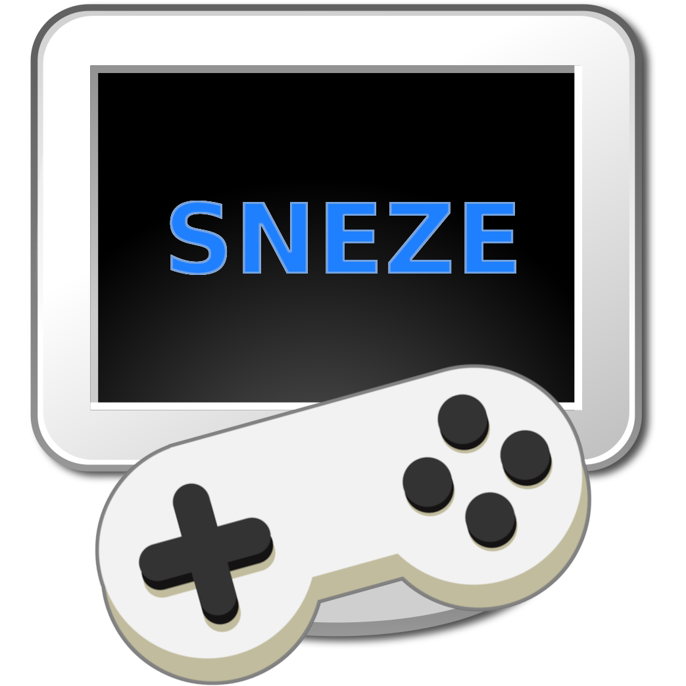
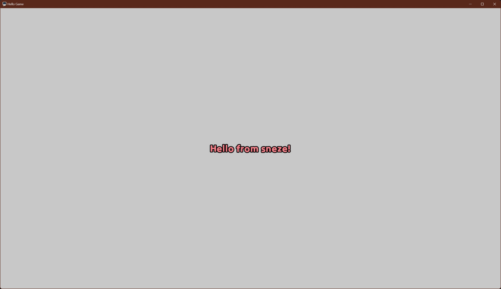
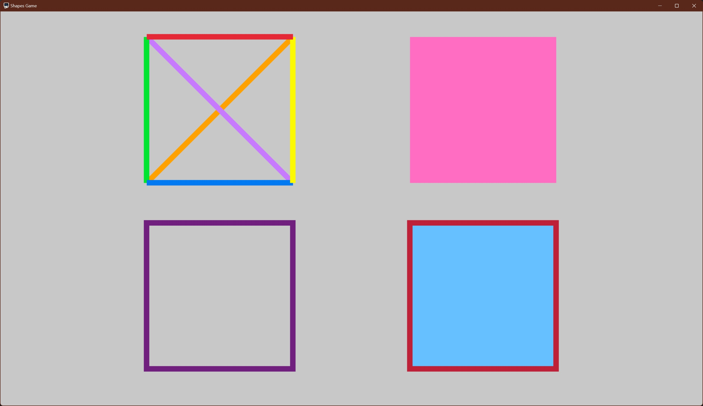
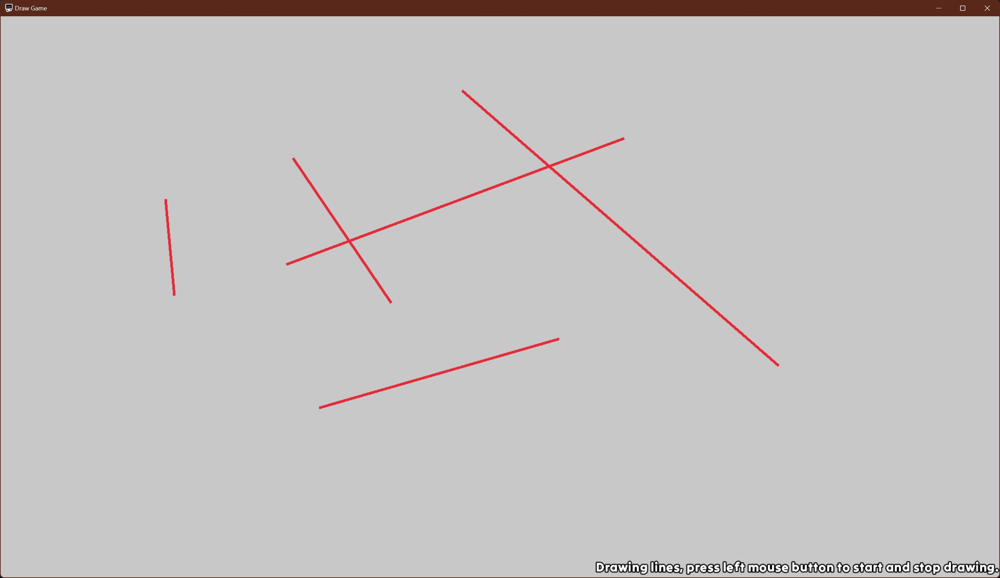
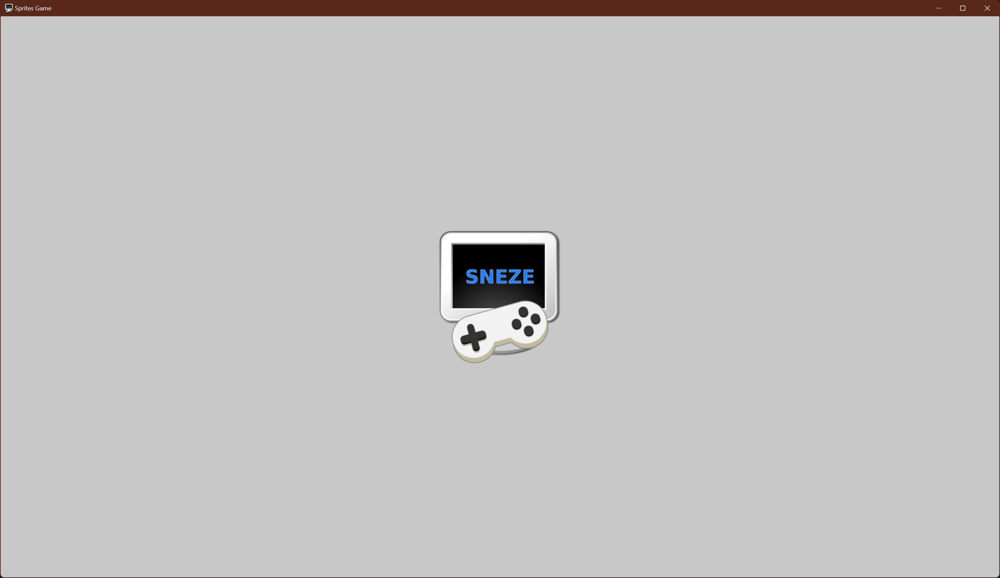
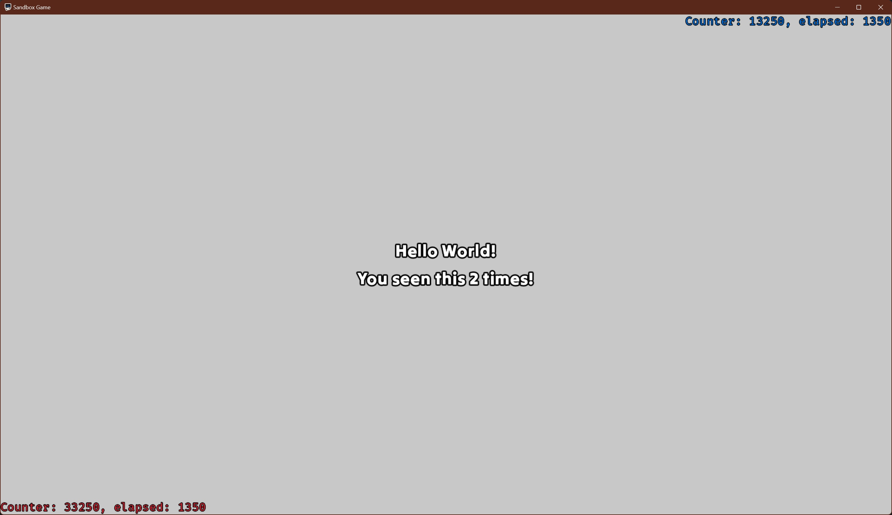

# SNEZE Examples

  

### All examples will

- run in a window that can be resized.\
- window size and screen monitor will be saved on closing.
- can toggle between fullscreen and windowed mode by pressing ALT+ENTER.
- will close when the user presses the ESC key.
- handle window resizing and content scaling.

### List of examples

- [Hello](hello) : An example to learn how to display text.

  

- [Shapes](shapes) : An example to learn drawing shapes such lines and boxes.

  

- [Draw](draw) : A example to learn to handle the mouse.

  

- [Sprites](sprites) : A simple example that shows how to render a sprite.

  

- [Sandbox](sandbox) : A sandbox used internally by testing new features.

  

